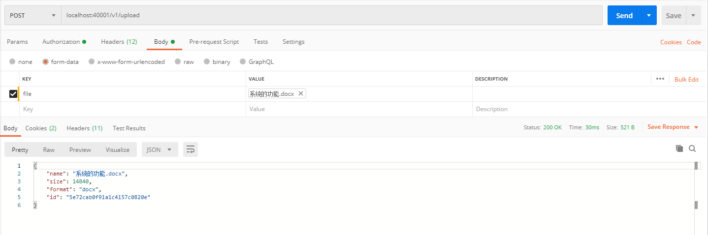
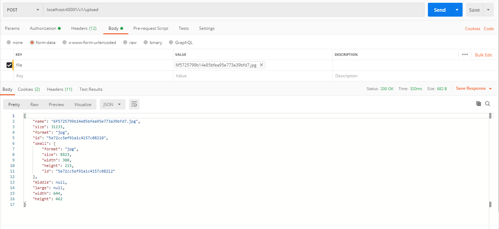

文件上传
-------
* 文件保存在mongodb里

```java
@Controller
public class FileUploadController extends DefaultHandler{
	
	@Resource
	private GridFSBucket gridFSBucket;
```


* 文件上传，使用统一的上传接口，返回file的id，使用固定的url来访问文件

```java
POST /v1/upload

```


普通文件上传，实例
---------------



返回格式：
```json

{
    "name": "系统的功能.docx",
    "size": 14840,
    "format": "docx",
    "id": "5e72cab0f91a1c4157c0820e"
}
```


图片型文件上传，服务器会根据配置自动裁剪，返回大，中，小三张图片，供业务使用
----------


返回格式：
```json
{
    "name": "6f5725799b14e85bfea95e773a39bfd7.jpg",
    "size": 31133,
    "format": "jpg",
    "id": "5e72cc5ef91a1c4157c08210",
    "small": {
        "format": "jpg",
        "size": 8823,
        "width": 300,
        "height": 215,
        "id": "5e72cc5ef91a1c4157c08212"
    },
    "middle": null,
    "large": null,
    "width": 644,
    "height": 462
}
```
图片类型的全局配置，用来指定图片的裁剪大小，图片只会缩小，不会放大，所以middle和large对象，根据原始图片本身大小，可能会返回null
---------

```
thumbnail:
  large:
    width: 1334
    height: 1334
  middle:
    width: 667
    height: 667
  small:
    width: 300
    height: 300    
    
```

