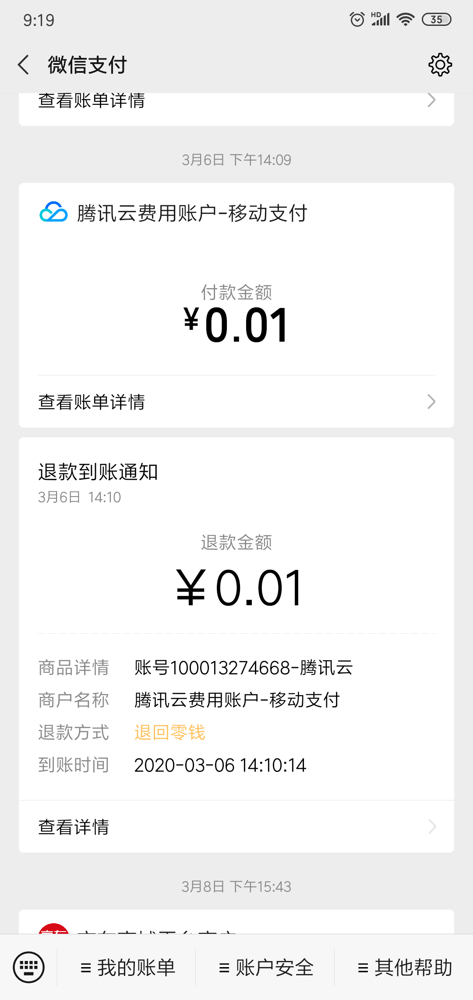

信息在系统的流转
-------------

* 本系统不同于传统的管理系统的最大区别在于，本系统以信息流管理和交互为主要目的，独特的设计思维

* 通过IM的自定义消息格式，实现了多终端，多角色的业务信息的无障碍沟通和支持移动办公

* 状态机和定时器内嵌入系统设置，使管理者和程序员可以灵活的自定义各类事件的处理流程

* 基于场景或者实体的群交互模式，可以使用户更加聚焦业务本身，而不是无意义的聊天

* 管理后台的推送的IM通知，使通知卡片和数据详细页之间的无缝衔接，单页操作无需各种搜索

* 基于状态机的数据主动推送各种消息给相关员工，员工不会遗忘处理事件

* 自定义消息事件卡的参考例子，包括web和app端，点击到各自详细页处理

