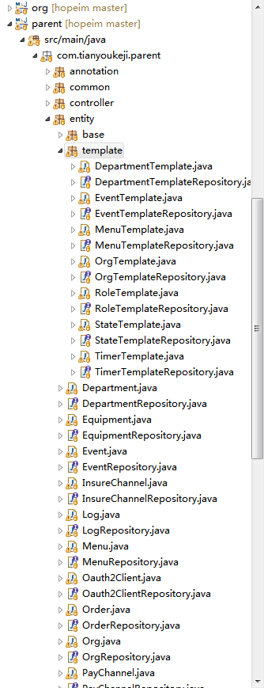

多租户系统
----------------

* 框架本身实现了一个简单的多租户系统，使框架能够为不同类型的企业实现不同的功能

* 每个类型的企业，具备一套完整的模板，位于com.tianyoukeji.parent.entity.template包，用于开通企业的时候部署使用





* 模板机制，使升级的新功能模板、菜单，不影响历史的企业

* 状态机模板部署，copy到具体的实体表

```java
@Autowired
private StateTemplateService stateTemplateService;

public void init(){
	stateTemplateService.entityStateDeploy("user");
}

```

* 企业部署，先建立企业，再把模板数据copy到对应的表，外加企业的id

```java

@Autowired
private OrgTemplateService orgTemplateService;
	
public void init() {
	Optional<User> findById = userRepository.findById(1L);
	User user = findById.get();
	// 根据platform模板给组织创建部门，角色，菜单
	Org org = orgTemplateService.orgTemplateDeploy("天邮平台", user, "platform", "中华人民共和国", "浙江省", "杭州市");
}

```