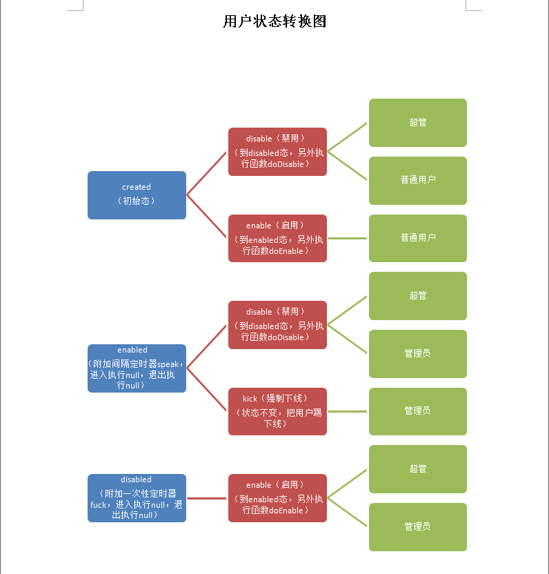

状态机介绍
--------------
* 状态机的概念和用法，自行百度

* 状态机框架，基于[Spring StateMachine](https://spring.io/projects/spring-statemachine#overview)

* 我们进行了细微的功能扩展

* 提高了状态机的可配置性和权限划分

* 进行了可视化扩展

状态机的使用范畴
-------------

* 所有具有生命周期性质的业务，都可以使用状态机模型

* 所有具有定时器性质的业务，都可以使用状态机模型

* 所有基于角色-操作的业务，都可以使用状态机模型

数据表
-------------
状态机涉及到的数据表包括 state ， event ， timer ，role

关系图（用户生命周期，简单例子）
----------------------

* 实体状态  -> 当前状态可执行动作 -> 这个动作可执行的角色

状态机的后台例子
------------------
