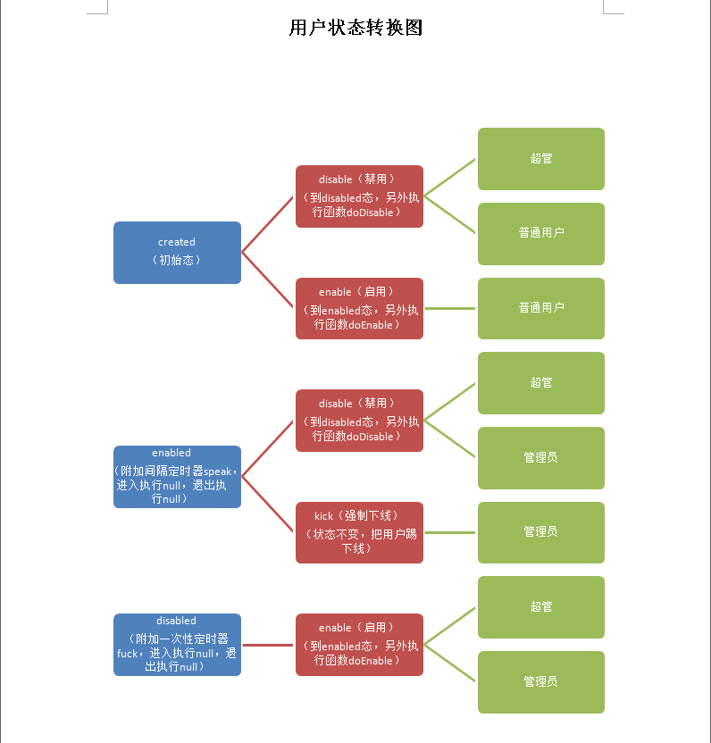

状态机介绍
--------------
* 状态机的概念和用法，自行百度

* 状态机框架，基于[Spring StateMachine](https://spring.io/projects/spring-statemachine#overview)，了解细节可以查询使用文档

* 我们进行了细微的功能扩展

* 提高了状态机的可配置性和权限划分

* 进行了可视化扩展

状态机的适用范畴
-------------

* 所有具有生命周期性质的业务，都可以使用状态机模型

* 所有具有定时器性质的业务，都可以使用状态机模型

* 所有基于角色-操作的业务，都可以使用状态机模型


数据表
-------------
状态机涉及到的数据表包括 state ， event ， timer ，role


关系图（用户生命周期，简单例子）
----------------------

* 实体状态  -> 当前状态可执行动作 -> 这个动作可执行的角色




状态机的代码样例
------------------

* 目标Entity实现了IStateMachineEntity接口

```java

@Entity
@Table(name = "user" , uniqueConstraints= {@UniqueConstraint(columnNames= {"union_id"})})
@EntityListeners(AuditingEntityListener.class)
public class User implements IStateMachineEntity,IRegionEntity,IDepartmentEntity{
	@Id
	@GeneratedValue(strategy = GenerationType.IDENTITY)
	@Column(name="uuid")
	private Long uuid;
	
```

* 实现一个对应的服务

```java

@Service
public class UserService extends StateMachineService<User> {


```

* StateMachineService<T>

```java
/**
 * 状态机服务基础服务类
 * 
 * 封装了stateMachine的创建，和变换和持久化功能
 * 
 * @author Administrator
 *
 * @param <T>
 */

public abstract class StateMachineService<T extends IStateMachineEntity> extends BaseService<T> {	
	/**
	 * 不带log的事件触发器
	 * @param id
	 * @param eventCode
	 * @return 
	 */

	@Transactional
	public void dispatchEvent(Long id, String eventCode) {
	}
	/**
	 * 带log的事件触发器
	 * @param id
	 * @param eventCode
	 * @param params 这个是用于log的对象，一般可以设置为控制器接收的body
	 */
	@Transactional
	public void dispatchEvent(Long id, String eventCode , Object params) {
	}
	
	/**
	 * 当前状态下的当前登录用户可执行事件，如果是null，则默认为start的状态
	 * 
	 * @param
	 * @return
	 */
	public List<String> currentUserExecutableEvent(String state) {
	}
	/**
	 * 根据query，返回一个具体的map格式的对象detail,包含了当前用户角色在当前状态机可执行事件events
	 * 
	 * @param queryString
	 * @return
	 */
	@Override
	public Map fetchOne(String queryString) {
	}
	

```

* 在控制器或者服务中调用, dispatchEvent 执行失败会抛出一个异常

```java

@RestController
@RequestMapping("/v1/user")
@Api(tags = "用户的接口")
public class V1UserController extends DefaultHandler {

	@Autowired
	private UserService userService;

	@PostMapping(path = "/{uuid}/kick")
	@ApiOperation(value = "踢下线", notes = "如果用户在线则直接踢下线", httpMethod = "POST")
	public HttpPostReturnUuid kick(@PathVariable(required = true) Long uuid) {
		userService.dispatchEvent(uuid, "kick");
		return new HttpPostReturnUuid(uuid);
	}
	
```
